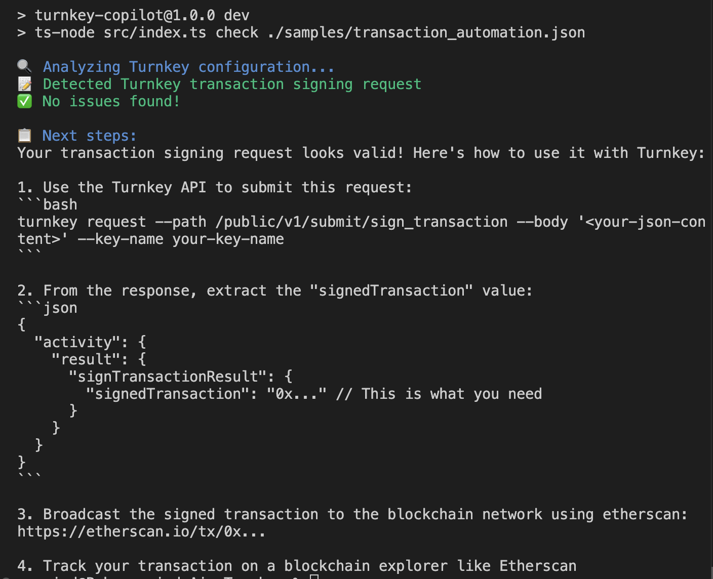

# Turnkey Copilot CLI

A smart assistant that enhances your Turnkey experience with interactive guidance and insights.

## ✨ Why I Built This

Turnkey provides an excellent foundation for secure blockchain operations. I built this companion tool to:

1. **Enhance Understanding**: Provide intuitive explanations of Turnkey policies and configurations
2. **Accelerate Development**: Offer actionable guidance for transaction signing workflows
3. **Simplify Onboarding**: Help new users quickly master Turnkey's powerful features

This tool complements Turnkey's excellent documentation by providing interactive, context-aware assistance directly in your development workflow.

## 🚀 Features

- **Configuration Analysis**: Validates Turnkey configurations and identifies potential issues
- **Policy Validation**: Checks policy files for common mistakes and security issues
- **Transaction Request Validation**: Verifies transaction signing requests and provides next steps
- **AI-Powered Explanations**: Translates cryptic errors into clear, actionable explanations
- **Fix Suggestions**: Generates ready-to-use code snippets to fix identified issues

## 🧰 Usage

Clone the repo:

```bash
git clone https://github.com/aravind33b/turnkey-copilot.git
cd turnkey-copilot
```

Install dependencies:

```bash
npm install
```

Copy the .env.example file to .env and fill in the required values:

```bash
cp .env.example .env
```

Check a Turnkey configuration, policy, or transaction signing request:

```bash
npm run dev -- check ./path/to/file.json
```

Add `--verbose` flag for AI-powered explanations (requires OpenAI API key):

```bash
npm run dev -- check ./path/to/file.json --verbose
```

## Examples

**Checking a Transaction Signing Request**

```bash
npm run dev -- check ./samples/transaction_automation.json
```

Output:



**Checking a Policy File**

```bash
turnkey-copilot check ./samples/policy.json
```

Output:
```
🔍 Analyzing Turnkey configuration...
📋 Detected Turnkey policy file

🚨 Found 1 potential issue:

[Issue 1]:
Condition contains placeholder <SENDER_ADDRESS>

[Suggested Fix]:
Replace <SENDER_ADDRESS> with an actual blockchain address
```